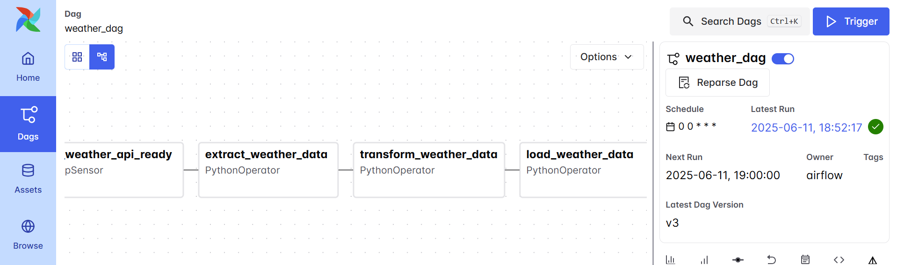
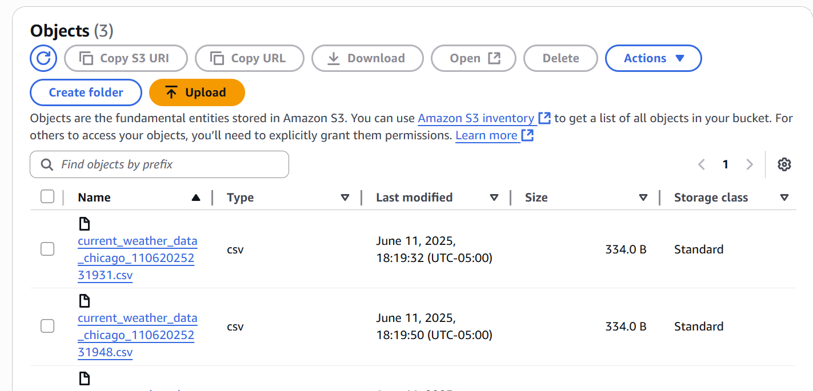

# 🌤️ Weather Data Pipeline Using Apache Airflow & AWS S3

This project is an end-to-end data pipeline that uses Apache Airflow (via Astro CLI) to fetch current weather data for **Chicago** using the OpenWeatherMap API. The data is transformed into a tabular format and stored as a timestamped `.csv` file in an **Amazon S3 bucket**.

---

## 📦 Tech Stack

- **Apache Airflow** (via Astro CLI)
- **Python 3.12**
- **Pandas**
- **AWS S3**
- **OpenWeatherMap API**
- **s3fs** & **boto3**

---

## 📋 Features

- ⏰ Scheduled data extraction using Airflow DAGs
- 🔄 Transforms JSON response into a structured DataFrame
- ☁️ Uploads cleaned data to an S3 bucket in `.csv` format
- 🧾 Timestamped filenames for historical tracking

---

### ✅ DAG Workflow:

Here's a screenshot of the DAG (`weather_dag`) successfully running in Apache Airflow:




---

## 🛠️ Setup Instructions

### 1. Clone the Repository

```bash
git clone https://github.com/your-username/weather-data-pipeline.git
cd weather-data-pipeline
